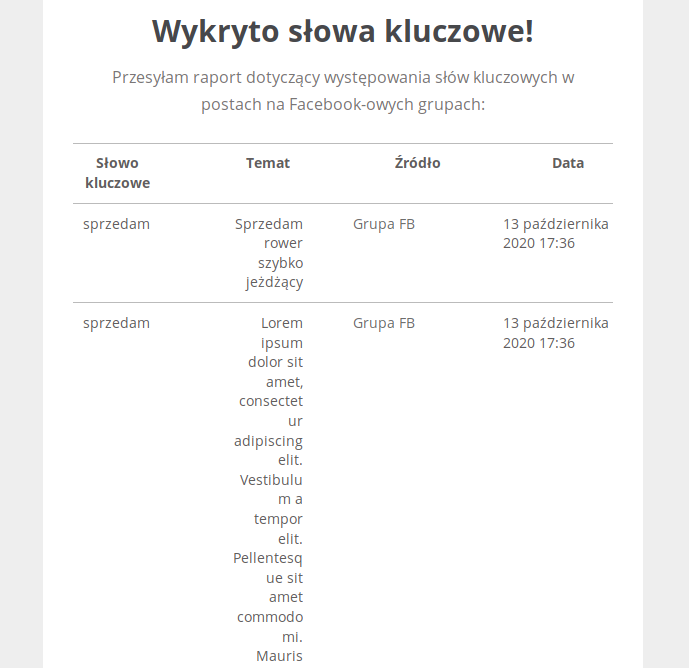

ver. 2.0

### Jak uruchomić

* Pierwsze uruchomienie może wymagać 2krotnego uruchomienia kontenera Docker-a:

``
docker-compose up --build
``

Następnie po wykonaniu się migracji bazy danych

``
docker-compose down
``

``
docker-compose up
``

* Przechodzimy do Panelu zarządzania localhost:8000/admin/
* Ustawiamy interwały czasowe w menu zarządzania taskami Celery

1 zadanie:

``
Periodic Tasks -> intervals lub crontabs -> ustawiamy na 10 min
``

2 zadanie

``
Periodic Tasks -> intervals lub crontabs -> ustawiamy na 13 min
``

* Przechodzimy do: `` Periodic Tasks -> Periodic tasks `` i ustawiamy 2 zadania - `` get_facebook `` oraz `` send_email ``

Raporty przyjdą na e-maila skonfigurowanego w parametrach konfiguracyjnych.




### Środowisko interatkwyne

1. Zainstaluj python3 dodając interpreter do zmiennych środowiskowych;
2. Utwórz wirtualne środowisko w /measure24/measure24/facebook_test
`` 
python -m venv /sciezka_do/measure24/measure24/facebook_test
``\
3. Uruchom wirtualne środowisko
``/sciezka_do/measure24/measure24/facebook_test/venv/Scripts/activate``
4. Rozpocznij sekwecję testującą
``/sciezka_do/measure24/measure24/facebook_test/test.py``

### Wersja serwerowa

1. Uruchom środowisko
``docker-composer up --build``

Panel dostępny jest pod adresem 
``localhost:8000/admin``\
Dane do bazy danych i dane logowania znajdują się w:
``.env``

### Zmiany handler-ów DOM

- Odbywają się za pomocą zmiennych w plikach ``common/facebook.py`` oraz ``facebook_test/test.py``
```python
tag_attr = "class"
tag_value = "dn"
```

### Problemy
##### Brak powiadomień e-mail
- Należy uzupełnić plik .env w dane dostępowe serwera SMTP.